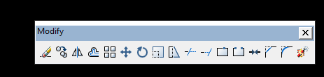
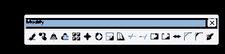
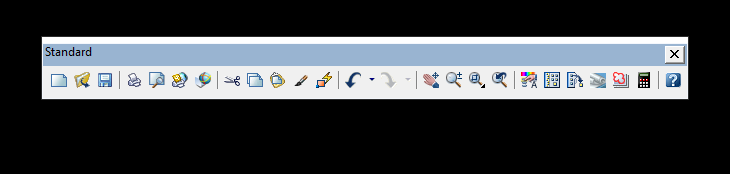
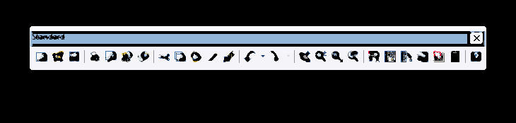

# 🎨 AnimeImage — تبدیل تصاویر به استایل Anime

<p align="center">
  
  
</p>

<p align="center">
  <b>Original → Anime Style</b><br>
  پردازش خودکار تصاویر با Python + OpenCV
</p>

<p align="center">
  
  
  
  
  
</p>

## ✨ این پروژه چه کاری انجام می‌دهد؟

**AnimeImage** یک پروژه‌ی ساده و قابل توسعه برای پردازش تصویری است که تصاویر PNG داخل پوشه‌ی `01/` را دریافت می‌کند و نسخه‌ی پردازش‌شده‌ی آن‌ها را داخل پوشه‌ی `MT/` می‌سازد.

در نسخه‌ی فعلی، **هر ۱۳ تصویر موجود در `01/` پردازش شده‌اند** و خروجی متناظر آن‌ها با همان نام در `MT/` قرار گرفته است.

> نکته: این پروژه در حال حاضر یک فیلتر پردازش تصویر مبتنی بر OpenCV است؛ مدل هوش مصنوعی مولد (مثل Stable Diffusion) در آن استفاده نشده است.

---

## 🖼️ نتیجه‌ی پردازش

در این پروژه ساختار خروجی به این شکل است:

| شماره | تصویر اصلی | تصویر پردازش‌شده |
|---|---|---|
| 01 | [مشاهده](01/01.png) | [مشاهده](MT/01.png) |
| 02 | [مشاهده](01/02.png) | [مشاهده](MT/02.png) |
| 03 | [مشاهده](01/03.png) | [مشاهده](MT/03.png) |
| 04 | [مشاهده](01/04.png) | [مشاهده](MT/04.png) |
| 05 | [مشاهده](01/05.png) | [مشاهده](MT/05.png) |
| 06 | [مشاهده](01/06.png) | [مشاهده](MT/06.png) |
| 07 | [مشاهده](01/07.png) | [مشاهده](MT/07.png) |
| 08 | [مشاهده](01/08.png) | [مشاهده](MT/08.png) |
| 09 | [مشاهده](01/09.png) | [مشاهده](MT/09.png) |
| 10 | [مشاهده](01/10.png) | [مشاهده](MT/10.png) |
| 11 | [مشاهده](01/11.png) | [مشاهده](MT/11.png) |
| 12 | [مشاهده](01/12.png) | [مشاهده](MT/12.png) |
| 13 | [مشاهده](01/13.png) | [مشاهده](MT/13.png) |

### 🎯 یک نمونه‌ی قبل و بعد

<p align="center">
  
  &nbsp;&nbsp;➡️&nbsp;&nbsp;
  
</p>

---

## 🛠️ چه کارهایی انجام شده است؟

### 1. 📂 آماده‌سازی تصاویر
تصاویر ورودی از پوشه‌ی:

`01/`

خوانده می‌شوند و فایل‌های PNG به‌صورت مرتب پردازش می‌شوند.

### 2. 🔍 خواندن تصویر با OpenCV
اسکریپت `tools/anime_mt.py` تصویر را با OpenCV می‌خواند و حالت‌های مختلف PNG، از جمله تصویر دارای Alpha، را مدیریت می‌کند.

### 3. 🧈 نرم‌کردن نواحی تصویر
از **Bilateral Filter** استفاده شده است تا قسمت‌های تخت و نویزی نرم‌تر شوند، در حالی که لبه‌های مهم تصویر تا حد زیادی حفظ شوند.

### 4. 🎨 کاهش و دسته‌بندی رنگ‌ها
با **K-Means Color Quantization** تعداد رنگ‌های مؤثر تصویر کاهش داده می‌شود تا ظاهر تصویر به سبک رنگ‌آمیزی سل‌انیمیشن نزدیک‌تر شود.

### 5. ✏️ تقویت خطوط
با تبدیل تصویر به خاکستری، Median Blur و Adaptive Threshold، خطوط و جزئیات اصلی استخراج و تقویت می‌شوند.

### 6. 🌈 بهبود رنگ
اشباع رنگ کمی افزایش داده می‌شود تا خروجی ظاهر زنده‌تر و نزدیک‌تری به استایل انیمه داشته باشد.

### 7. 🪟 حفظ شفافیت
اگر تصویر ورودی دارای کانال Alpha باشد، Alpha آن حفظ و همراه خروجی PNG ذخیره می‌شود.

### 8. 💾 تولید خروجی PNG
خروجی‌ها با نام اصلی در پوشه‌ی:

`MT/`

ذخیره می‌شوند.

---

## 🤖 پردازش خودکار GitHub Actions

برای اینکه پردازش فقط به اجرای دستی روی کامپیوتر وابسته نباشد، یک Workflow در:

`.github/workflows/anime-mt.yml`

قرار داده شده است.

این Workflow وقتی فایل‌های داخل `01/`، اسکریپت پردازش یا خود Workflow تغییر کنند، اجرا می‌شود. همچنین امکان اجرای دستی با **Run workflow** وجود دارد.

مراحل اتوماسیون:

`01/*.png`
→ نصب Python و کتابخانه‌ها
→ اجرای `tools/anime_mt.py`
→ ساخت `MT/*.png`
→ ثبت تغییرات
→ Commit و Push خودکار

---

## 📦 ساختار پروژه

```text
AnimeImage/
├── 01/
│   ├── 01.png
│   ├── 02.png
│   ├── ...
│   └── 13.png
│
├── MT/
│   ├── 01.png
│   ├── 02.png
│   ├── ...
│   └── 13.png
│
├── tools/
│   └── anime_mt.py
│
├── .github/
│   └── workflows/
│       └── anime-mt.yml
│
└── README.md
```

---

## 🚀 اجرای پروژه روی کامپیوتر

پیش‌نیازها:

- Python 3.11 یا بالاتر
- OpenCV
- NumPy

نصب کتابخانه‌ها:

```bash
pip install opencv-python numpy
```

سپس:

```bash
python tools/anime_mt.py
```

بعد از اجرا، خروجی‌ها در پوشه‌ی `MT/` قرار می‌گیرند.

---

## ⚙️ منطق اصلی پردازش

پردازش هر تصویر تقریباً این مسیر را طی می‌کند:

```text
Original PNG
     │
     ▼
Read with OpenCV
     │
     ▼
Preserve Alpha
     │
     ▼
Bilateral Smoothing
     │
     ▼
K-Means Color Quantization
     │
     ▼
Edge / Line Extraction
     │
     ▼
Combine Color + Line Work
     │
     ▼
Saturation / Brightness Adjustment
     │
     ▼
Restore Alpha
     │
     ▼
MT/XX.png
```

---

## 📋 چه چیزهایی انجام شده و چه چیزهایی انجام نشده؟

### ✅ انجام شده

- [x] آماده‌سازی ساختار پروژه
- [x] نگهداری ۱۳ تصویر ورودی
- [x] پردازش هر ۱۳ تصویر
- [x] ایجاد ۱۳ خروجی در پوشه‌ی `MT/`
- [x] پردازش خودکار با Python
- [x] استفاده از OpenCV
- [x] Color Quantization
- [x] Edge/Line Processing
- [x] افزایش کنترل‌شده‌ی رنگ
- [x] حفظ Alpha در PNG
- [x] اجرای خودکار با GitHub Actions
- [x] Commit خودکار خروجی‌های جدید
- [x] مستندسازی پروژه در README

### ⏳ هنوز انجام نشده / خارج از نسخه‌ی فعلی

- [ ] مدل مولد AI برای تبدیل واقعی سبک (مانند Stable Diffusion)
- [ ] رابط گرافیکی دسکتاپ
- [ ] اپلیکیشن Android
- [ ] پردازش ویدئو
- [ ] انتخاب سبک‌های متعدد Anime
- [ ] تنظیمات گرافیکی برای شدت خطوط و رنگ
- [ ] Web/API interface
- [ ] آموزش مدل اختصاصی

این موارد را می‌توان در نسخه‌های بعدی اضافه کرد.

---

## 💡 چرا این پروژه مفید است؟

هدف پروژه این است که یک مسیر **ساده، قابل فهم و خودکار** برای تبدیل مجموعه‌ای از تصاویر به ظاهر انیمه‌ای فراهم کند.

مزیت مهم این ساختار این است که فقط یک تصویر را پردازش نمی‌کند؛ می‌توان مجموعه‌ای از تصاویر را در یک Pipeline پردازش کرد و خروجی‌ها را با همان نام‌ها در پوشه‌ی جداگانه تحویل گرفت.

---

## 🔧 فایل اصلی پردازش

منطق اصلی در این فایل قرار دارد:

**`tools/anime_mt.py`**

این فایل مسئول خواندن تصاویر، پردازش، حفظ Alpha و ذخیره‌ی خروجی‌هاست.

Workflow اتوماتیک نیز در:

**`.github/workflows/anime-mt.yml`**

قرار دارد.

---

## 🌟 توسعه‌های پیشنهادی نسخه بعدی

برای حرفه‌ای‌تر شدن AnimeImage می‌توان نسخه‌ی بعدی را با امکانات زیر توسعه داد:

1. **🎭 چند سبک Anime**
   - Soft Anime
   - Classic Anime
   - Manga
   - Cel Shading
   - High Detail

2. **🎚️ کنترل شدت افکت**
   - شدت خطوط
   - تعداد رنگ‌ها
   - Saturation
   - Brightness
   - Smoothing

3. **🖥️ رابط گرافیکی**
   - Drag & Drop
   - Preview قبل/بعد
   - Batch Processing
   - انتخاب پوشه‌ی خروجی

4. **⚡ پردازش سریع‌تر**
   - پردازش چندتصویری
   - استفاده بهتر از CPU
   - امکان GPU در نسخه‌های آینده

5. **🤖 AI واقعی**
   - مدل‌های Image-to-Image
   - سبک‌های قابل انتخاب
   - کنترل شدت تغییر چهره و جزئیات

---

## 📸 درباره‌ی تصاویر این Repository

پوشه‌ی `01/` شامل تصاویر ورودی است و پوشه‌ی `MT/` خروجی‌های پردازش‌شده را نگهداری می‌کند.

به این ترتیب مقایسه‌ی نتیجه ساده است:

**01 = Original**  
**MT = Processed / Anime Style**

---

## 👨‍💻 پروژه

**Repository:** `dbdallk/AnimeImage`

این README برای توضیح شفاف وضعیت فعلی پروژه، روش پردازش، ساختار فایل‌ها و امکانات انجام‌شده نوشته شده است.

اگر این پروژه را توسعه می‌دهید، پیشنهاد می‌شود برای هر تغییر بزرگ، یک Commit جداگانه ثبت شود تا تاریخچه‌ی توسعه قابل پیگیری باشد.

---

## ❤️ جمع‌بندی

**AnimeImage در نسخه‌ی فعلی یک Pipeline پردازش تصویر خودکار است، نه یک مدل مولد AI.**

۱۳ تصویر موجود پردازش شده‌اند و خروجی متناظر آن‌ها در `MT/` قرار دارد. کد پردازش در Python/OpenCV نوشته شده و GitHub Actions نیز برای اجرای خودکار پردازش و ثبت خروجی‌ها آماده شده است.

> 🎨 **Original → Processing → Anime Style → PNG**

<p align="center">
  <b>Made with Python • OpenCV • NumPy • GitHub Actions</b>
</p>
